# 📚 BookNook - Online Bookstore E-Commerce System

🚀 **Project Overview**  
BookNook is a comprehensive e-commerce platform tailored for an online bookstore. Built with PHP and MySQL, it offers a seamless user experience for customers browsing and purchasing books, alongside a robust admin interface for managing inventory and orders. This project highlights my expertise in full-stack web development, secure coding practices, and responsive UI design.

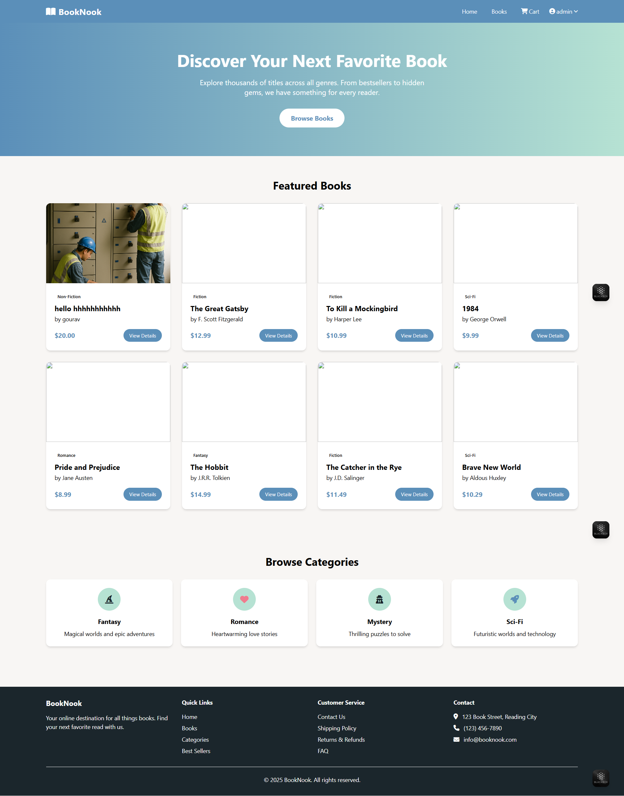

---

## ✨ Key Features  
- **User Authentication**: Secure registration and login with password hashing.  
- **Product Catalog**: Browse books by categories with dynamic filtering.  
- **Shopping Cart**: Add, update, or remove items with real-time updates.  
- **Checkout Process**: Streamlined order placement and confirmation.  
- **Admin Dashboard**: Manage products and orders with full CRUD functionality.  
- **Responsive Design**: Optimized for all devices using Tailwind CSS.  

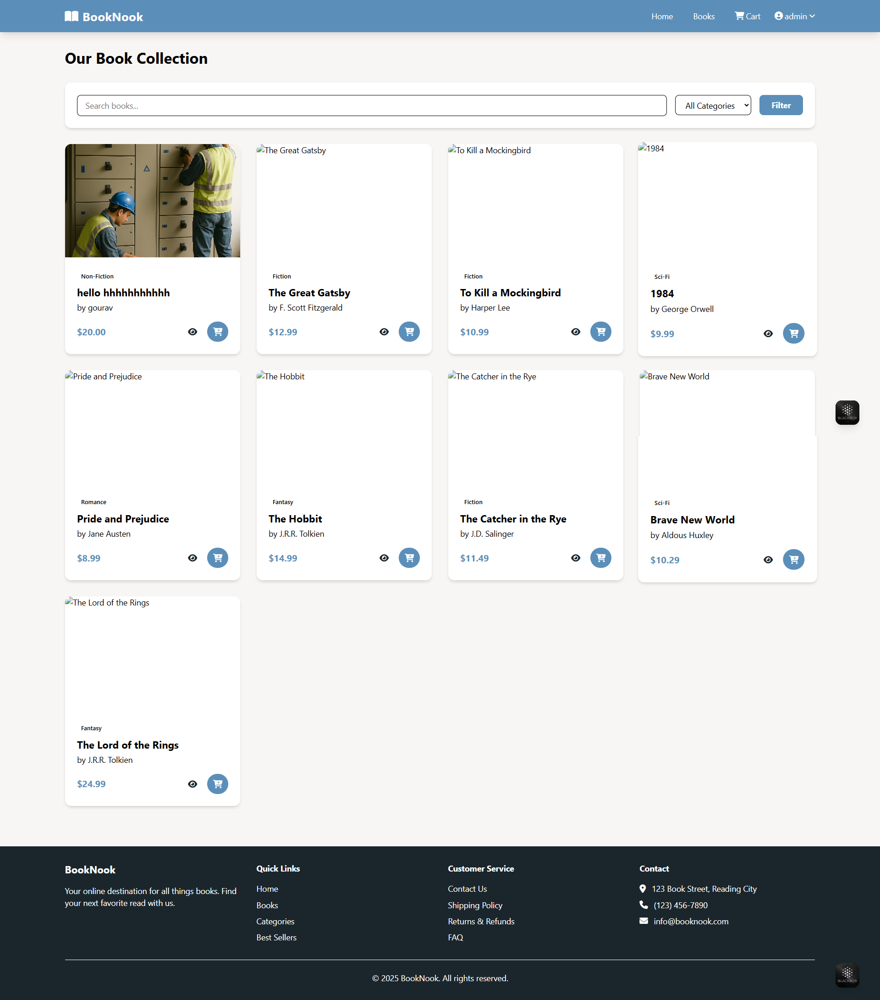

---

## 🛠️ Technologies Used  
- **Frontend**: HTML5, Tailwind CSS, JavaScript  
- **Backend**: PHP 8.2, MySQL with PDO  
- **Database**: MySQL 5.7+  
- **Server**: XAMPP/Apache  
- **Version Control**: Git  

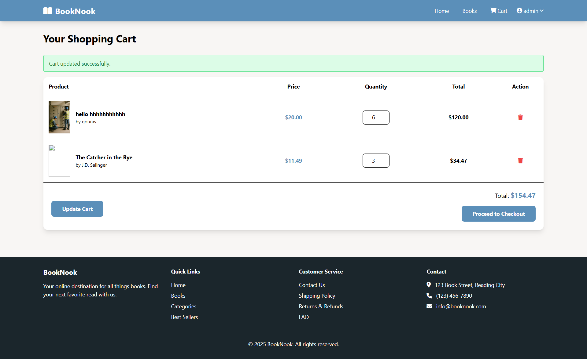

---

## 📦 Project Structure  
```
bookstore/
├── assets/
│   ├── css/                # Stylesheets
│   ├── images/             # Book images and assets
│   └── js/                 # JavaScript files
├── includes/
│   ├── config.php          # Database configuration
│   ├── header.php          # Common header
│   └── footer.php          # Common footer
├── admin/
│   ├── dashboard.php       # Admin dashboard
│   ├── orders/             # Order management
│   └── products/           # Product management
├── classes/
│   ├── Cart.php            # Cart logic
│   ├── Product.php         # Product logic
│   └── User.php            # User authentication logic
├── pages/
│   ├── home.php            # Homepage
│   ├── products.php        # Product listing
│   └── account.php         # User account page
├── processes/
│   ├── cart-processes/     # Cart operations
│   └── user-processes/     # User operations
├── ss/                     # Screenshots
│   ├── account.png
│   ├── cart.png
│   ├── dashboard.png
│   ├── home.png
│   ├── orders_view.png
│   ├── products_delete.png
│   ├── products_list.png
│   ├── book.png
│   ├── checkout.png
│   ├── db.png
│   ├── list.png
│   ├── products_add.png
│   └── products_edit.png
└── bookstore.sql           # Database schema
```

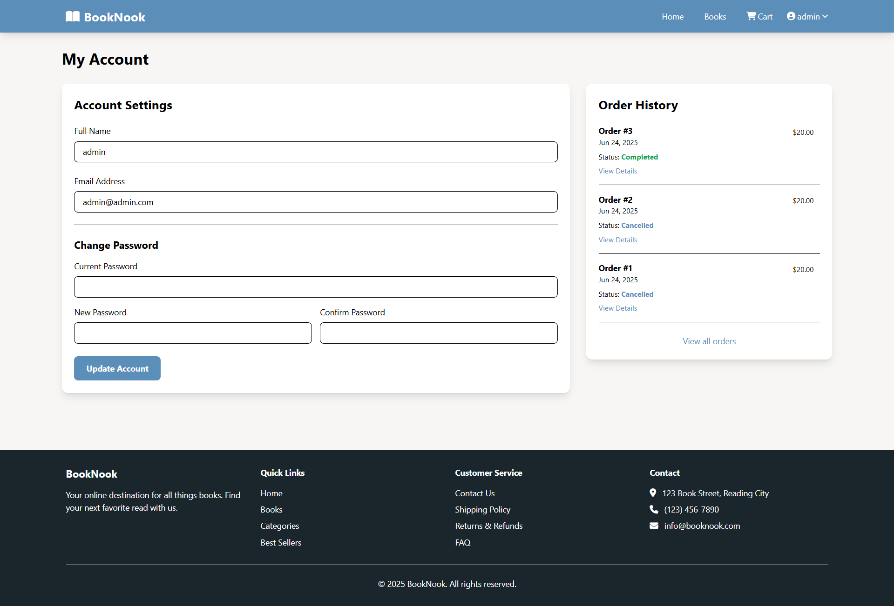

---

## 🛠️ Project Setup  

### Prerequisites  
- XAMPP/WAMP/LAMP stack  
- PHP 8.2+  
- MySQL 5.7+  
- Composer (optional for dependency management)  
- Git  

### Installation Steps  

1. **Clone the Repository**  
   Clone the project to your local machine:  
   ```bash
   git clone https://github.com/gourav4222f/bookstore.git
   cd bookstore
   ```

2. **Database Setup**  
   - Import the `bookstore.sql` file into your MySQL database:  
     ```bash
     mysql -u root -p bookstore < bookstore.sql
     ```
   - Update database credentials in `includes/config.php`:  
     ```php
     define('DB_HOST', 'localhost');
     define('DB_USER', 'root');
     define('DB_PASS', '');
     define('DB_NAME', 'bookstore');
     ```
   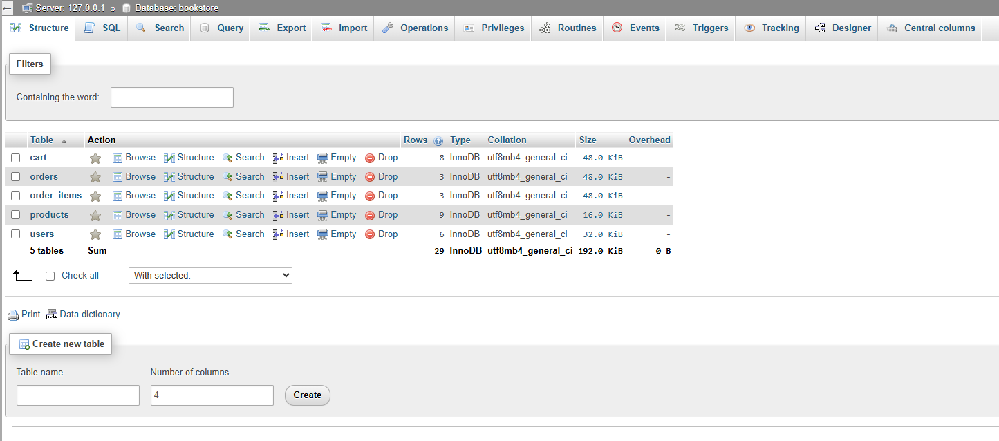

3. **Configure Base URL**  
   Set the base URL in `includes/config.php`:  
   ```php
   define('BASE_URL', 'http://localhost/bookstore');
   ```

4. **Set Up Uploads Directory**  
   Create and set permissions for the uploads directory:  
   ```bash
   mkdir uploads
   chmod 755 uploads/
   ```

5. **Start Development Server**  
   - Place the project in your XAMPP `htdocs` folder.  
   - Start Apache and MySQL via XAMPP.  
   - Access the application at `http://localhost/bookstore`.  

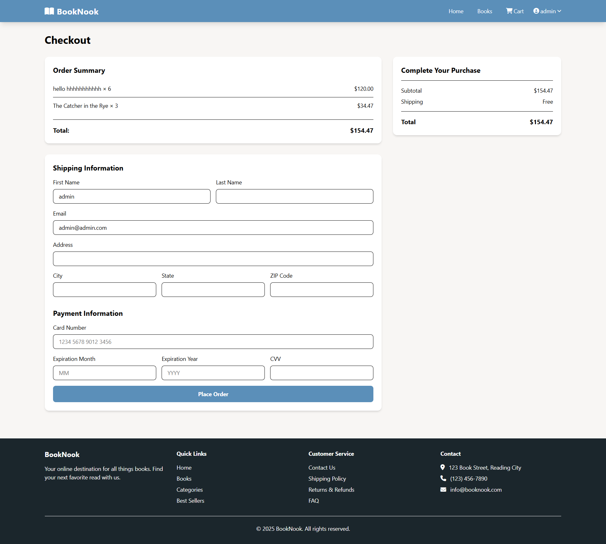

---

## 🖼️ Application Screenshots  

### Customer Interface  
- **Product Listing**: Browse books with ease.  
  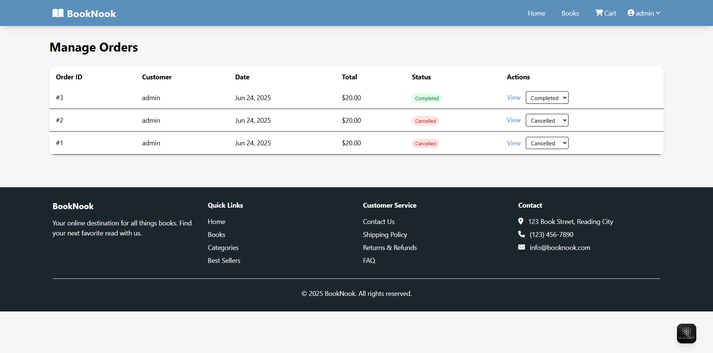  
- **Cart**: Manage items before checkout.  
    
- **Checkout**: Complete purchases securely.  
    

### Admin Interface  
- **Dashboard**: Centralized admin control panel.  
  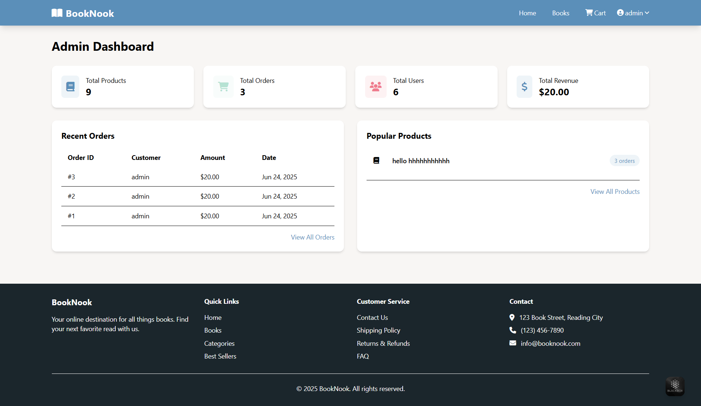  
- **Product Management**: View and manage inventory.  
  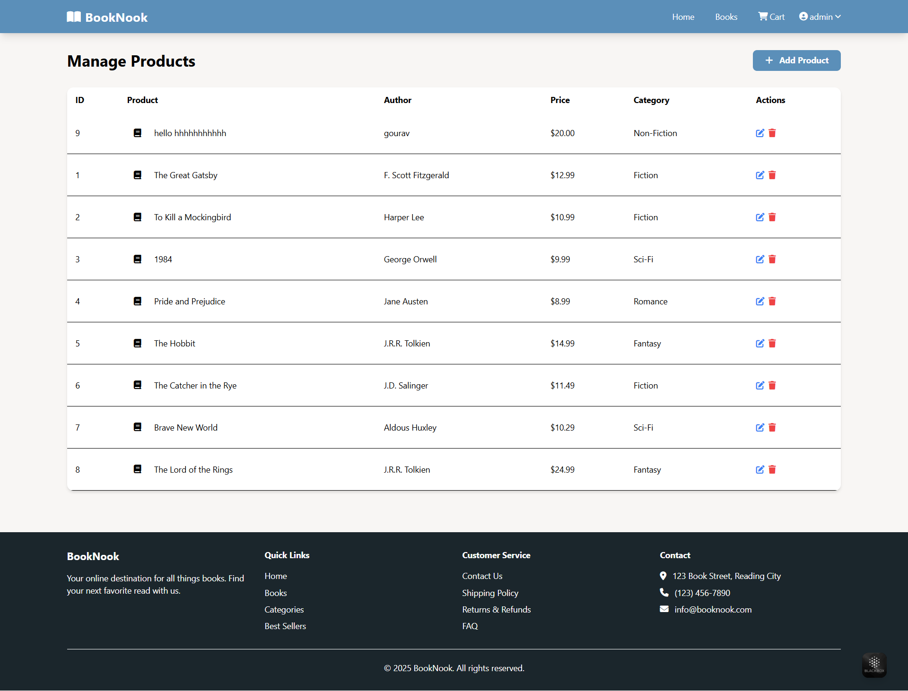  
- **Add Product**: Easily add new books.  
  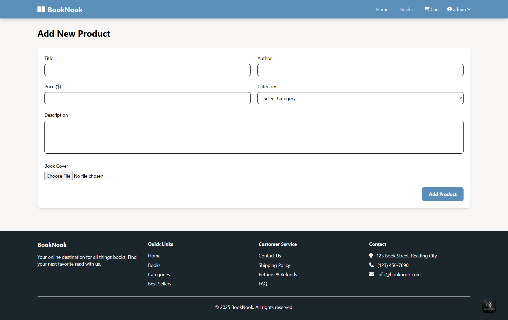  
- **Edit Product**: Update book details.  
  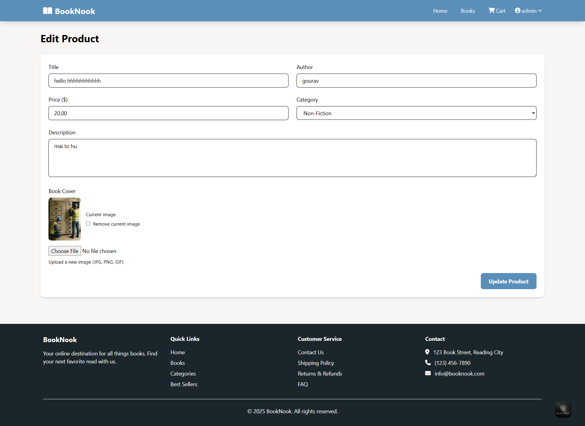  
- **Delete Product**: Remove books from inventory.  
  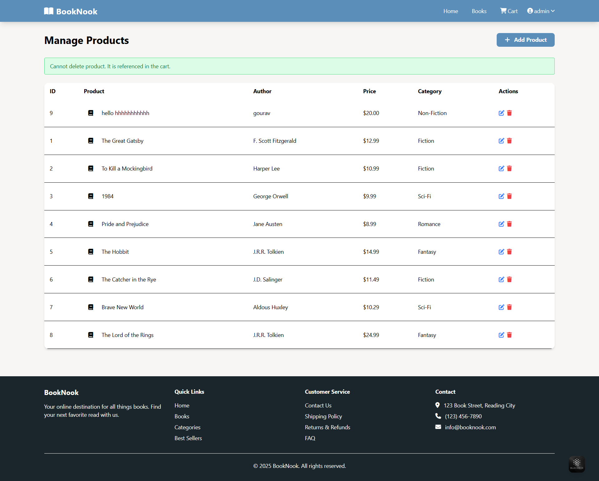  
- **Orders View**: Track and manage customer orders.  
  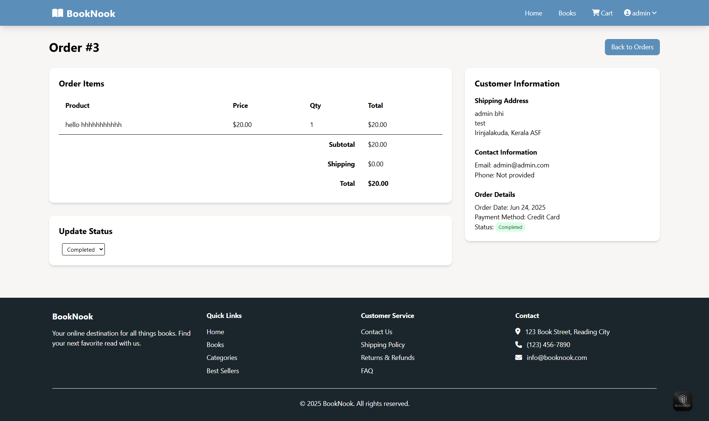  

---

## 🧑‍💻 Developer Notes  

### Key Technical Highlights  
- **MVC-like Architecture**: Organized codebase with separate classes for Cart, Product, and User logic.  
- **Secure Authentication**: Implements `password_hash()` for secure user authentication.  
- **PDO Prepared Statements**: Ensures protection against SQL injection.  
- **Responsive UI**: Tailwind CSS delivers a modern, device-agnostic design.  
- **Admin CRUD Operations**: Full create, read, update, and delete functionality for products and orders.  


---

## 🚀 Future Enhancements  
- Integrate payment gateways (e.g., Stripe, PayPal).  
- Add user reviews and ratings for books.  
- Implement advanced search and filtering.  
- Generate PDF invoices for orders.  
- Develop RESTful API endpoints for mobile app support.  

---

## 📜 License  
This project is licensed under the **MIT License** - free for educational and personal use.  

---

## 👨‍💻 About the Developer  
Developed with ❤️ by gourav.  
- **Email**: gouravthakur200319@gmail.com  
- **GitHub**: [github.com/gourav4222f](https://github.com/gourav4222f)  

**Last Updated**: August 2023
